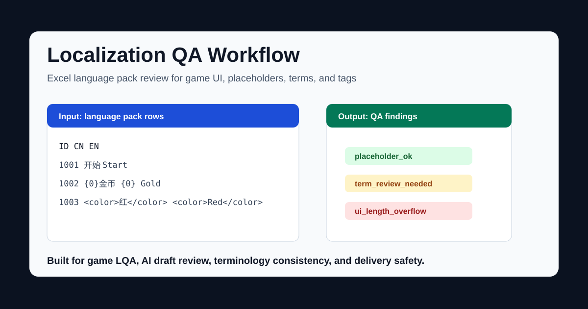
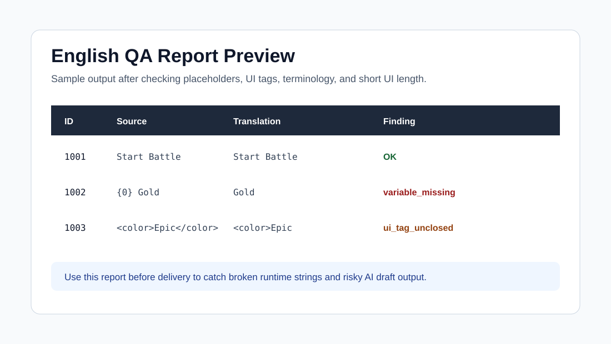

# Localization QA Workflow

> Game localization QA workflow for Excel language packs, AI draft review, terminology consistency, placeholder validation, and UI tag safety.



这是一个面向**游戏本地化团队**的质检工作流仓库，专门处理 **AI 粗翻后的 Excel 语言包**。它会自动检查变量占位符、UI 标签、术语一致性、格式模式和高风险翻译问题，并输出可复核的质检结果。

**Keywords:** game localization QA, localization workflow, Excel translation QA, terminology consistency, placeholder validation, UI tag validation, AI translation review, game LQA.

## Why This Project Exists

Most localization tools stop at translation or generic QA. This project focuses on the messy middle:

- AI draft output that still needs human review
- Excel-based language packs used by game teams
- Variables, BBCode, UI tags, and short UI strings that are easy to break
- Repeatable QA rules that can run before delivery instead of after bug reports

## 中文概述

面向游戏本地化场景的自动化质检工具，处理 AI 粗翻后的语言包（Excel 格式），自动检测变量占位符、UI 标记、术语一致性等问题，输出质检报告。

## 30-Second Example

```bash
git clone https://github.com/zhangzeyu99-web/localization-workflow.git
cd localization-workflow
pip install -r requirements.txt
python process_language.py --input sample-language.xlsx --lang en
```

## English Sample Input and Output



- [English sample input CSV](examples/english-sample-input.csv)
- [English sample QA output](examples/english-sample-output.md)

## 功能

| 模块 | 说明 |
|------|------|
| **变量检测** | 检查翻译中变量占位符（`{0}`, `%s` 等）是否完整 |
| **UI 标记检测** | 检查 UI 控件标记（`<color>`, `<size>` 等）是否匹配 |
| **术语一致性** | 基于术语库检查关键术语翻译是否一致 |
| **格式模式检测** | 检测数字格式、标点、空格等模式问题 |
| **AI 审查** | 调用 LLM 对可疑条目进行二次审查 |
| **GUI 界面** | 可视化操作界面，支持拖放 Excel 文件 |

## 支持语言

| 优先级 | 语言 |
|--------|------|
| P0 | 英语 |
| P1 | 法语、德语、土耳其语、西班牙语、葡萄牙语、俄语 |

## 安装

```bash
pip install -r requirements.txt
```

## 使用

```bash
# CLI 模式
python cli.py --input <excel_file> --language en

# GUI 模式
python gui.py

# 处理单个语言
python process_language.py --input <excel_file> --lang en

# 英语全量翻译 harness：目标列为空或中文回填时先准备 workpack
python scripts/run_translation_harness.py --input <excel_file> --term-base <terms.xlsx> --lang en --output-dir <output_dir> --style-hint "US mobile SLG; concise, idiomatic wording"

# 主 agent 写完 translation_response.jsonl 后，严格按 ID 回填并进入 QA
python scripts/run_translation_harness.py --input <excel_file> --term-base <terms.xlsx> --lang en --output-dir <output_dir> --response <output_dir>/translation_response.jsonl --run-qa

```

## 项目结构

```text
localization-workflow-project/
├── cli.py                  # 命令行入口
├── gui.py                  # GUI 入口（Tkinter）
├── process_language.py     # 语言处理主逻辑
├── requirements.txt        # Python 依赖
├── utils/                  # 工具模块
│   ├── ai_checker.py       #   AI 审查器
│   ├── excel_reader.py     #   Excel 读取器
│   ├── pattern_detector.py #   格式模式检测
│   ├── term_checker.py     #   术语一致性检查
│   ├── ui_detector.py      #   UI 标记检测
│   └── variable_checker.py #   变量占位符检查
├── docs/
│   └── 使用说明书.md        # 详细使用文档
├── tools/
│   └── codex-residential-launcher/  # Codex + Clash 住宅 IP 启动封装（见该目录 README）
├── output/                 # 输出目录
│   └── ai_review/          #   AI 审查结果
└── workflow-design.md      # 需求与设计文档
```

## 相关工具

- **[Codex + 固定住宅 IP（Clash Verge）完整落地指南](tools/codex-residential-launcher/README.md)**  
  Windows 下可用 **`tools/codex-residential-launcher/start-codex-desktop.cmd`**（根入口，路径自适应）或 `scripts\Start-CodexDesktop.cmd` 启动 Desktop；另有 CLI 脚本、Merge 模板、VS Code 代理说明与排障；可单独拷贝目录到其他机器复用。

## 文档

- [变更日志](CHANGELOG.md)
- [使用说明书](docs/使用说明书.md)
- [工作流说明](工作流说明.md)
- [工作流设计文档](workflow-design.md)
- [不可读缩写与截断词拦截规则](docs/readability-abbreviation-gate.md)
- [质量回归 Harness](docs/quality-harness.md)
- [英语全量翻译 Harness](docs/translation-harness.md)
- [项目管理](docs/project-management.md)

## 最新更新（2026-05-12）

本次更新把英语目标列为空或中文回填时的“全量翻译 -> 严格回填 -> QA 收口”固定成 agent-operated harness。脚本不调用 API，也不自动操作 ChatGPT 网页；主 agent 负责生成译文，脚本负责抽取、协议校验、按 ID 回填、隐藏缓存和后半 QA。

### 已合入改动

- 英语全量翻译 harness
  - `scripts/run_translation_harness.py` 可生成 `translation_workpack.jsonl`、`translation_manifest.json` 和 `translation_response.jsonl`
  - response 只允许 `ID + translation`，回填前会拒绝漏 ID、重复 ID、额外 ID、乱序、输入漂移、占位符漂移、标签漂移和换行漂移
  - 目标列为空、近乎全空或大量中文回填时，先把中文作为种子列再全量替换，避免空列流程和 QA 断层
  - 支持 `--style-hint` / `--style-hint-file` 注入项目风格提示，例如“面向美国移动端用户、SLG、简短地道表达”
  - 同项目翻译记忆只写入输入目录下的 `.translation_cache/<lang>.jsonl`，默认不跨项目复用
  - 已用真实 63 行中文回填英语表验证完整闭环：机审需确认 `0`，`quality_harness` 对最终 workbook 返回 `passed: True`
- 通用 workbook QA 扫描增强
  - `run_quality_harness.py` 扫真实 workbook 时会跳过 glossary/术语 sheet，只对正文和 UI 做通用行级 QA，避免术语词典 Title Case 误杀
  - `run_quality_harness.py` workbook 扫描改为非只读读取，且 `rows_scanned=0` 会失败，避免假通过
- 严格 AI 审核链路
  - `prepare / merge` 以 manifest 和 fingerprint 绑定批次，避免输入输出词条错配
  - 模型回填必须逐条输出 `ID | KEEP` 或 `ID | FIX | corrected translation`，缺行或乱序会直接拒绝合并
- 工作区批处理入口
  - 支持按目录发现语言表和术语表，适合直接处理项目目录
- 拼音残留检测与自动修复
  - 能识别 `Hongshangu`、`Jushizhen`、`Meiguihu`、`Xigu...`、`Lanshidi` 这类专名拼音残留
  - 对已知地图名和地点名可直接按标准映射回写
- UI 短文案长度硬约束
  - 先把中文原文可见长度 `<= 10` 的短文本纳入候选
  - 再按类型分层处理：紧凑 UI 走硬约束，普通短文本走软提示，编号专名和复杂富文本豁免
  - 英语预算为 `min(26, max(8, 中文可见长度 * 2 + 8))`，用于避免把正常词组压成拼音或截断词
  - 机审会新增 `ui_length_overflow`
  - AI 审核 prompt 会带上 `LEN:mode=...,source=...,target=...,budget<=...` 元数据，要求在自然可懂前提下尽量贴近中文长度
- 不可读缩写 / 截断词硬门槛
  - 机审会拦截 `PERR`、`DTT`、`IJA`、`CL##1##2` 这类内部代码式文案
  - 机审会拦截 `rewa`、`obta`、`coll imme`、`tmrw` 这类截断词
  - AI 审核 prompt 明确要求：长度和可读性冲突时，以自然可懂为准
- 英文大小写风格复检
  - 错误、状态、提示类文案默认使用 sentence case，例如 `Too many roles`、`System error`
  - Title Case 只保留给专名、功能名、标题、商店项和术语表明确要求的名称
- 质量回归 Harness
  - `fixtures/quality_regression.json` 固化历史坏例和好例，防止旧问题回归或误杀合理译文
  - `scripts/run_quality_harness.py` 可同时跑 fixture 和真实 workbook 扫描

### 典型适用场景

- 游戏 UI 文案、按钮、标签、菜单项
- 地图名、地点名、编号地名
- 含变量、BBCode、换行和富文本标签的语言表

## 使用注意事项

### 1. 首跑建议走小批次

- 建议 `batch-size` 先用 `80` 到 `100`
- 第一轮优先稳定性，不优先吞吐量

### 2. `prepare` 和 `merge` 之间不要换输入文件

- 严格链路会校验输入指纹
- 如果语言表在两步之间被替换、重排或改动，`merge` 会拒绝回填

### 3. 短文本长度约束先入池，再分层

- 中文原文可见长度 `<= 10` 的文本会先进入长度检查候选池
- 其中紧凑 UI 文案是硬约束，普通短文本是软提示，编号专名和复杂富文本会豁免
- 完整句子仍然不适合用这条规则强压长度
- 规则优先级仍然是：自然可懂第一，长度第二

### 4. 专名和世界观名词要尽量进术语表

- 如果项目故意保留音译或有官方专名，不要只依赖内置规则
- 建议把标准译名补进术语表，避免被拼音残留规则或长度规则误判

### 5. 复杂富文本不要走激进自动修复

- 含大量 `[color]`、`[size]`、`[v0]`、`[b0]` 之类标签的行，优先保结构安全
- 模型和规则都必须保留占位符、标签和换行

### 6. 报告里重点关注这几类问题

- `romanized_name_residue`
- `ui_length_overflow`
- `opaque_abbreviation`
- `clipped_word`
- `title_case_overuse`
- `variable_missing`
- `variable_extra`
- `term_missing`

### 7. 最终交付前建议跑 quality harness

```bash
python scripts/run_quality_harness.py fixtures/quality_regression.json --workbook <final.xlsx>
```

### 8. `term_partial_hit` 与 hard gate 分开看

- `term_partial_hit` 通常表示多词术语只命中部分词，可能来自 UI 长度预算、自然表达或术语表过严
- 交付判断先看 hard gate：变量、标签、换行、中文残留、乱码、坏缩写、截断词、明显大小写问题必须清零
- 如果 `term_partial_hit` 不影响语义、可读性和核心术语一致性，可以作为软提示保留在报告中

## License

MIT
