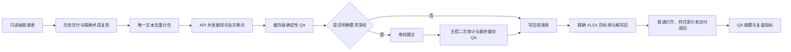

# 大文本多语言工作流 V2

## 适用范围

满足任一条件时使用本流程：目标语言超过 4 个、多 workbook 交付、唯一文本超过 5,000 条，或用户明确要求全量逐句/深度校对。

## 一键入口

```powershell
python scripts\run_large_text_multilingual_runner.py run `
  --input "<语言表.xlsx>" `
  --input "<UI表.xlsx>" `
  --term-base "<术语表.xlsx>" `
  --history-dir "<历史交付目录>" `
  --target-langs "EN,IDN,DE,FR,ES,PT,RU,IT,TR,TH" `
  --task-dir "<任务目录>" `
  --relay-config "<relay-api-config.json>" `
  --proofread-mode full
```

若非英语目标语言需要参考已校对英语，加 `--source-mode cn+en`；只有英语逐行完整并明确作为主源时才用 `--source-mode en`。英语参考会进入唯一文本签名、API 请求、checkpoint 和深校请求，英语变化后不会复用旧缓存。完整契约见 `BILINGUAL_SOURCE_REFERENCE_WORKFLOW.md`。

只准备分包、不调用 API：

```powershell
python scripts\run_large_text_multilingual_runner.py prepare-pack `
  --input "<语言表.xlsx>" `
  --target-langs "EN,IDN,DE,FR,ES,PT,RU,IT,TR,TH" `
  --work-dir "<任务目录>\_work\large_text_multilingual"
```

## 实际执行图



## 性能策略

- 分包只顺序读取一次 workbook；源行和唯一文本分开记录。
- API 只处理历史交付、精确术语未覆盖的唯一内容。
- 批次按请求键落盘；重跑复用成功 checkpoint，不重复调用模型。
- 翻译和深校批次允许并发；XLSX 只在最终缓存 hard blocker 为 0 后写一次。
- 深校建议不能直接修改 workbook。subagent 或 API 只输出建议，主控审计后才进入最终缓存。
- 过程 JSONL、checkpoint、manifest、日志和复盘指标都留在 `_work`；交付目录只包含成品 workbook 和 `QA摘要.xlsx`。

## 验收门禁

1. `cache-lint`：空译文、中文残留、占位符/标签/数字丢失、强术语遗漏和未请求语言必须为 0。
2. `apply-dry-run`：普通模式可打开，样式引用合法。
3. 精确写回：文件、sheet、行号和源文四重匹配；源文漂移立即停止。
4. `readback-gate`：所有目标列非空，交付目录无过程文件；`QA摘要.xlsx` 不作为译文表重复扫描。
5. manifest：每阶段记录 `running/done/failed`、耗时和产物路径；API key 不得进入任何产物。

## Subagent 边界

- 只有用户明确要求深校或 subagent 时启用。
- 推荐按语言或项目分配，禁止多个 agent 同时写同一 workbook。
- 输入是唯一文本、当前译文、术语命中、语境和受保护 token。
- 输出只能是 `KEEP/FIX` 建议 JSONL；最终修改权属于主控的二次审计阶段。
- subagent 中断不影响已完成的 API 翻译 checkpoint；可以重新生成建议，不重跑初译。
