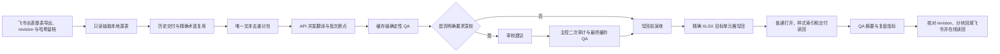

# 大文本多语言工作流 V2

## 适用范围

满足任一条件时使用本流程：目标语言超过 4 个、多 workbook 交付、唯一文本超过 5,000 条，或用户明确要求全量逐句/深度校对。

## 一键入口

```powershell
python scripts\run_large_text_multilingual_runner.py run `
  --input "<语言表.xlsx>" `
  --input "<UI表.xlsx>" `
  --term-base "<术语表.xlsx>" `
  --history-dir "<历史交付目录>" `
  --target-langs "EN,IDN,DE,FR,ES,PT,RU,IT,TR,TH" `
  --task-dir "<任务目录>" `
  --relay-config "<relay-api-config.json>" `
  --batch-size 60 `
  --workers 4 `
  --proofread-batch-size 30 `
  --proofread-workers 8 `
  --proofread-mode full
```

若非英语目标语言需要参考已校对英语，加 `--source-mode cn+en`；只有英语逐行完整并明确作为主源时才用 `--source-mode en`。英语参考会进入唯一文本签名、API 请求、checkpoint 和深校请求，英语变化后不会复用旧缓存。完整契约见 `BILINGUAL_SOURCE_REFERENCE_WORKFLOW.md`。

只准备分包、不调用 API：

```powershell
python scripts\run_large_text_multilingual_runner.py prepare-pack `
  --input "<语言表.xlsx>" `
  --target-langs "EN,IDN,DE,FR,ES,PT,RU,IT,TR,TH" `
  --work-dir "<任务目录>\_work\large_text_multilingual"
```

## 实际执行图



## 性能策略

- 分包只顺序读取一次 workbook；源行和唯一文本分开记录。
- API 只处理历史交付、精确术语未覆盖的唯一内容。
- 翻译批次与深校批次独立配置。默认初译 `60 × 4 workers`，深校 `30 × 8 workers`；根据模型限流调整，不用放大多语言响应换取表面上的少批次。
- 深校按单一目标语言分批，避免一个响应同时承载多语言结果而截断；review checkpoint 按 `review_key + lang` 复用，改变批大小后只补缺失单元。
- reviewer 对 `KEEP` 省略重复译文时，以当前译文补齐 `suggested`；`FIX` 缺少新译文仍立即失败，不能降低审校覆盖门禁。
- 同一任务目录只允许一个深校主进程；`proofread.lock` 拒绝重复进程，防止共享 checkpoint 时重复调用。
- 翻译、深校建议和二次审计允许受控并发；XLSX 只在最终缓存 hard blocker 为 0 后写一次。
- 深校建议不能直接修改 workbook。subagent 或 API 只输出建议，主控审计后才进入最终缓存。
- `sampled` 模式审全部高风险唯一文本，并按稳定签名抽取 10% 低风险唯一文本；`full` 模式审全部唯一文本。
- 过程 JSONL、checkpoint、manifest、日志和复盘指标都留在 `_work`；交付目录只包含成品 workbook 和 `QA摘要.xlsx`。

## 失败恢复收口

API 返回截断等异常如果已通过缓存补齐继续完成，不得让 manifest 永久停留在 `api_translate_failed`。只有 final cache-lint、深校摘要、apply-dry-run、交付目录和 readback 全部存在且通过时，才运行：

```powershell
python scripts\run_large_text_multilingual_runner.py reconcile `
  --manifest "<task>\_work\large_text_multilingual\large_text_multilingual_manifest.json" `
  --final-cache "<task>\_work\large_text_multilingual\final_cache.jsonl" `
  --final-cache-lint "<task>\_work\large_text_multilingual\final_cache_lint.json" `
  --proofread-summary "<task>\_work\large_text_multilingual\proofread_summary.json" `
  --apply-dry-run "<task>\_work\large_text_multilingual\apply_dry_run.json" `
  --readback-gate "<task>\_work\large_text_multilingual\final_readback_gate.json" `
  --delivery-dir "<task>\交付目录" `
  --reason "provider response truncated"
```

命令会保留原失败状态和原因，登记验证证据，生成 `recovery_retro.json`，再把关键阶段收口为 `done`。任一门禁未通过时拒绝收口。

## 飞书长表离线优先

1. 解析 Wiki 到真实 sheet token，读取当前 revision。
2. 整个 workbook 导出到 `<task_dir>\_source\`，文件名或审计 JSON 记录 revision、下载时间和 SHA256。
3. 后续抽取、翻译、深校、缓存 QA、精确 XLSX 写回和本地读回都只基于该归档副本；处理中不写飞书。
4. 本地 `cache-lint`、成品逐格读回和交付目录检查全部通过后，再读取在线 revision；与基线不一致时停止并重新比对，不盲目覆盖。
5. 只写用户指定 sheet、行列范围，分块记录每次写入后的 revision；完成后在线读取源列和目标列，与本地最终缓存逐格比较。
6. “本地成品完成”和“飞书回填读回完成”是两个独立验收点，任一失败都不得声明完整交付。

## 验收门禁

1. `cache-lint`：空译文、中文残留、占位符/标签/数字丢失、强术语遗漏和未请求语言必须为 0。
2. `apply-dry-run`：普通模式可打开，样式引用合法。
3. 精确写回：文件、sheet、行号和源文四重匹配；源文漂移立即停止。
4. `readback-gate`：所有目标列非空，交付目录无过程文件；`QA摘要.xlsx` 不作为译文表重复扫描。
5. manifest：每阶段记录 `running/done/failed`、耗时和产物路径；API key 不得进入任何产物。
6. 恢复任务：不得手工改 manifest；只能凭已验证产物运行 `reconcile`。

## Subagent 边界

- 只有用户明确要求深校或 subagent 时启用。
- 推荐按语言或项目分配，禁止多个 agent 同时写同一 workbook。
- 输入是唯一文本、当前译文、术语命中、语境和受保护 token。
- 输出只能是 `KEEP/FIX` 建议 JSONL；最终修改权属于主控的二次审计阶段。
- subagent 中断不影响已完成的 API 翻译 checkpoint；可以重新生成建议，不重跑初译。
