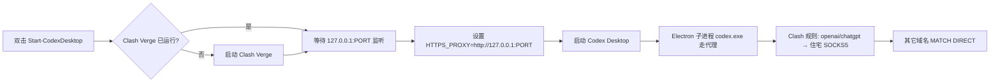

# Codex + 住宅 IP（Clash Verge）稳定启动封装

在**不开 TUN** 的前提下，让 **Codex Desktop / CLI** 走本机 Clash 的 **mixed-port**，由 Clash **规则分流**把 OpenAI / ChatGPT / Claude 域名出口落到**固定住宅 IP**；其余流量 **DIRECT**，尽量不打乱公司网与浏览器。

---

## 当前封装相对「随手开 Clash + 双击 Codex」优化了什么

| 点 | 说明 |
|----|------|
| **只代理 Codex 进程树** | 通过 `HTTPS_PROXY`/`HTTP_PROXY` 仅作用于从启动脚本拉起的子进程；**不启用系统代理、不开 TUN**，避免全局 DNS/路由被改坏公司网。 |
| **自动拉起 Clash Verge** | 若未运行则启动，并**轮询等待 mixed-port 监听**，避免 Codex 先起、代理未就绪导致偶发失败。 |
| **可选结束旧实例** | `Start-CodexDesktop.ps1 -KillExisting`（cmd 包装已默认开启）减少多开争用 **同一套 `~/.codex/auth.json` 刷新令牌** 的概率。 |
| **配置与密钥分离** | 仓库只含 `config/clash-merge.yaml.example`；真实 SOCKS5 填在你本机 Merge 里，**不要提交 Git**。 |
| **新机复用** | 复制本目录 → 配 `.env` → 配 Clash Merge → 双击 `scripts\Start-CodexDesktop.cmd` 即可。 |

---

## 端到端流程（你要记在脑子里的顺序）



1. **Clash Verge** 加载订阅 + **Merge**（住宅 SOCKS5 + 仅 AI 域名走 `AI-Services`）。
2. 本机 **mixed-port**（如 `7897`）提供 HTTP 入口。
3. 启动脚本为 **Codex 子进程**设置 `HTTPS_PROXY` → 流量进 Clash。
4. Clash **按域名**把 OpenAI 相关请求送到 **kookeey 等住宅出口**；其它仍走你机器默认出口（如香港公司网）。

---

## 在新机器上复用（GitHub）

### 1. 拷贝本目录

把 `tools/codex-residential-launcher/` 整个目录拷走，或从本仓库 clone 后只取该子目录。

### 2. 安装依赖

- [Clash Verge Rev](https://github.com/clash-verge-rev/clash-verge-rev/releases)
- [Codex Desktop](https://openai.com/) / 或官方安装包路径与默认一致

### 3. 配置 Clash Merge（住宅 IP）

1. 打开 `config/clash-merge.yaml.example`，复制内容。
2. 在 Clash Verge：**配置 → Merge**（或编辑 Merge 文件），粘贴并填写你的 **SOCKS5 住宅** `server/port/username/password`。
3. 保存并让 Clash **重载配置**。确认 **mixed-port** 与下面 `.env` 里一致。

### 4. 本机 `.env`（不要提交）

```text
copy env.example .env
```

用记事本编辑 **与 `scripts` 同级的** `.env`（即 `codex-residential-launcher\.env`）：

- `CLASH_VERGE_EXE`：Clash 可执行文件完整路径  
- `CLASH_MIXED_PORT`：与 Clash 里 mixed-port 一致  
- `CODEX_DESKTOP_EXE` / `CODEX_CLI_EXE`：若安装路径非默认，写绝对路径（**不要用 `%VAR%`**，本脚本简单解析不展开）

### 5. 启动

- **桌面版**：双击 `scripts\Start-CodexDesktop.cmd`  
- **命令行**：在 PowerShell 里执行：

  ```powershell
  .\scripts\Start-CodexCLI.ps1
  # 或带参数
  .\scripts\Start-CodexCLI.ps1 exec "hello"
  ```

### 6. 推到 GitHub

在仓库根目录（或 monorepo 根）：

```bash
git add tools/codex-residential-launcher
git commit -m "chore: add Codex residential launcher scripts"
git push
```

**切勿**把含密码的 `Merge.yaml`、真实 `.env` 提交上去。

---

## 登录与「refresh token was already used」

- **设备码登录**（`codex login --device-auth`）建议 **直连** 完成，避免住宅 IP 对 auth 接口 **429**。  
- 登录/刷新时尽量**只留一个 Codex 客户端**（先关 Desktop 再 CLI 登录），避免并发刷新 **同一条 refresh token**。

---

## 验证是否走固定出口（可选）

在 Codex 已用脚本启动、Clash 已开的前提下，用另一终端（**不设**代理）访问普通网站应为本地/公司出口；对 `api.openai.com` 的探测若经 `127.0.0.1:PORT` 代理应返回 **401**（说明到达 OpenAI 而非被墙 HTML）。

---

## 许可

脚本以 MIT 随仓库发布；Clash / Codex / 住宅 IP 服务各自遵循其厂商条款。
